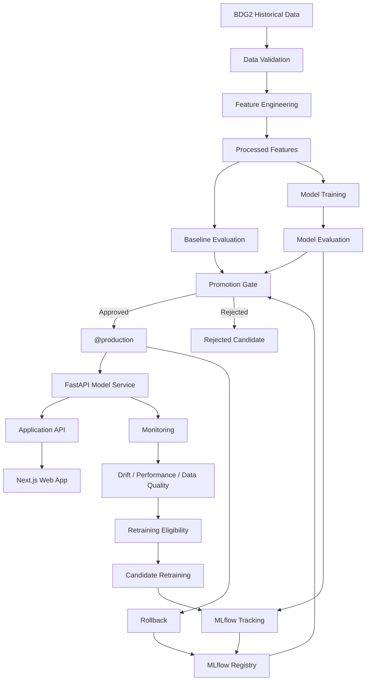

<div align="center">

# Building & Energy Intelligence Platform

### End-to-end ML forecasting and MLOps for building energy intelligence

<p>
A production-oriented portfolio system covering the complete ML lifecycle:
<strong>data → training → evaluation → serving → monitoring → controlled retraining</strong>
</p>

<p>
<strong>Python · scikit-learn · FastAPI · Next.js · MLflow · Docker</strong>
</p>

<p>
<a href="https://github.com/Someshwar12/building-energy-intelligence">View Repository</a>
&nbsp; · &nbsp;
<strong>64 tests passing</strong>
&nbsp; · &nbsp;
<strong>CPU-first</strong>
&nbsp; · &nbsp;
<strong>MIT License</strong>
</p>

</div>

---

## Overview

The <strong>Building & Energy Intelligence Platform</strong> is an end-to-end machine-learning application for <strong>next-hour building electricity consumption forecasting</strong>.

It was deliberately built as a complete engineering system rather than a standalone notebook. The repository connects historical data, validation, feature engineering, model evaluation, inference, a web application, experiment tracking, model versioning, monitoring, controlled retraining, promotion decisions, and rollback.

The central principle is:

> <strong>A trained model is not automatically a production model.</strong>

A learned model must demonstrate measurable value over a simple persistence baseline before it can receive the production alias. If it does not, the platform retains the baseline serving strategy instead of forcing a deployment.

---

## Project Goals

### 🎓 Graduate admissions

The project demonstrates practical depth across:

- Machine learning and statistical evaluation
- Data processing and feature engineering
- API and application architecture
- Software engineering
- Testing and CI
- Docker and service orchestration
- Experiment tracking and model registries
- Monitoring and lifecycle design
- Reproducibility and technical documentation

### 💼 Internships and Werkstudent roles

The same system demonstrates how an ML model can become part of a real software product:

```text
Data
 ↓
Validation
 ↓
Feature Engineering
 ↓
Model Training
 ↓
Evaluation
 ↓
Model Registry
 ↓
Inference API
 ↓
Web Application
 ↓
Monitoring
 ↓
Controlled Retraining
 ↓
Promotion / Rejection
 ↓
Rollback
```

The project is therefore relevant to ML, MLOps, Data Science, AI Engineering, and ML-adjacent software engineering roles.

---

# Product

The web application provides dedicated interfaces for:

| Area | Purpose |
|---|---|
| Buildings | Explore individual buildings and their energy context |
| Consumption | Inspect electricity-consumption behavior |
| Forecasts | Use the next-hour forecasting functionality |
| Anomalies | Surface detected consumption anomalies |
| Model Lab | Inspect models, experiments, lifecycle state, and baseline comparisons |
| Monitoring | Inspect service health, data quality, drift, performance, and reliability |

The frontend is designed as a product interface rather than a collection of technical debug screens.

---

# Architecture



### Runtime services

| Service | Port | Responsibility |
|---|---:|---|
| Web | 3000 | Next.js frontend |
| API | 4000 | Application API |
| Model Service | 8000 | FastAPI inference and ML endpoints |
| MLflow | 5000 | Experiment tracking and model registry |

All four services are orchestrated with Docker Compose.

---

# Machine Learning

## Prediction task

The primary task is:

<strong>Next-hour building electricity consumption forecasting</strong>

Target:

```text
target_next_hour_kwh
```

The inference pipeline uses <strong>168 hourly historical observations</strong> to construct temporal features.

## Feature groups

### Energy history
- Historical electricity consumption
- Lagged energy values
- Rolling energy statistics

### Weather
- Air temperature
- Dew temperature
- Sea-level pressure
- Wind direction
- Wind speed
- Cloud coverage
- Precipitation depth

### Building metadata
- Building ID
- Site ID
- Primary use
- Floor area / square feet

### Calendar
- Hour
- Day
- Day of week
- Month

### Thermal features
- Heating degree hours
- Cooling degree hours

---

# Models and Evaluation

Three learned model families are evaluated:

- Ridge
- Random Forest
- HistGradientBoosting

The project uses multiple metrics:

- MAE
- RMSE
- CVRMSE
- NMAE
- Macro-building NMAE

The macro-building metric is particularly important for lifecycle decisions because it prevents large buildings from dominating an aggregate result.

### Original evaluation

| Model | Validation MAE | Validation RMSE | Validation CVRMSE | Validation NMAE | Validation Macro-Building NMAE | Test MAE | Test RMSE | Test NMAE |
|---|---:|---:|---:|---:|---:|---:|---:|---:|
| Random Forest | 11.585128 | 28.264663 | 20.061556% | 0.082228 | 0.127556 | 10.830353 | 24.610103 | 0.076085 |
| HistGradientBoosting | 12.014662 | 29.071060 | 20.633917% | 0.085277 | 0.355616 | 11.015266 | 24.526046 | 0.077384 |
| Ridge | 16.439043 | 34.248344 | 24.308625% | 0.116680 | 4.065300 | 14.845004 | 29.860645 | 0.104289 |

---

# Baseline-First Model Governance

The learned models are evaluated against explicit baselines:

```text
pred_persistence
pred_previous_day
pred_previous_week
```

The primary operational baseline is <strong>pred_persistence</strong>: the next value is predicted using the most recent observed energy value.

The original evaluation recorded:

```text
Best baseline:
pred_persistence
NMAE = 0.0592740184411023
```

The production promotion metric is:

```text
validation_macro_building_nmae
```

A learned candidate must beat the corresponding persistence baseline before it can receive the production alias.

Conceptually:

```text
learned metric < baseline metric
        ↓
    eligible for promotion

otherwise
        ↓
      reject
```

This makes model complexity earn its place rather than assuming that a learned model is automatically better.

---

# MLOps Lifecycle

```text
NEW DATA
   ↓
DATA VALIDATION
   ↓
MONITORING
   ↓
POSSIBLE DEGRADATION
   ↓
RETRAINING ELIGIBILITY
   ↓
CANDIDATE TRAINING
   ↓
EXPERIMENT TRACKING
   ↓
MODEL REGISTRATION
   ↓
EVALUATION
   ↓
COMPARE WITH PRODUCTION
   ↓
COMPARE WITH PERSISTENCE BASELINE
   ↓
PROMOTION DECISION
   ├───────────────┐
   ↓               ↓
REJECT          PROMOTE
   │               │
   │               ↓
   │        NEW PRODUCTION
   │               │
   └──────→ INFERENCE
                   ↓
              MONITORING
```

Key rules:

- Drift does not automatically trigger retraining.
- Candidate models are isolated from production.
- Training does not automatically imply deployment.
- Registration does not imply production.
- Promotion requires explicit evaluation gates.
- Rejected candidates remain auditable.
- Rollback uses the MLflow production alias.
- The system never fabricates a production state.

---

# Controlled Retraining

Phase 6 introduced a bounded production-data simulation so the lifecycle can be exercised without claiming to have live external building telemetry.

Generated datasets:

```text
data/interim/production/normal_production.parquet
data/interim/production/shifted_production.parquet
```

Dataset size:

```text
12 buildings × 168 hourly observations = 2,016 rows
```

The shifted scenario introduces controlled changes to selected weather variables and target behavior.

Candidate retraining produced:

| Version | Model | Candidate NMAE | Persistence NMAE | Decision |
|---|---|---:|---:|---|
| v4 | Ridge | 13.008031 | 0.219467 | Rejected |
| v5 | Random Forest | 9.466449 | 0.219467 | Rejected |
| v6 | HistGradientBoosting | 2.904410 | 0.219467 | Rejected |

All three candidates failed the defined persistence-baseline gate.

Therefore the final state intentionally has:

```text
@production = no learned model
```

The platform continues with the persistence serving strategy.

This is a deliberate result, not an incomplete lifecycle demonstration. The project does not modify the simulator, models, thresholds, or promotion logic merely to manufacture a successful promotion.

---

# Monitoring

The monitoring system covers:

### Data quality
- Schema validity
- Missingness
- Invalid values
- Duplicates
- Temporal gaps
- Frequency consistency

### Drift
- Reference distribution
- Recent distribution
- Drift diagnostics

### Prediction performance
- MAE
- RMSE
- NMAE
- Macro-building NMAE
- Global performance
- Per-building performance
- Persistence baseline comparison

### Service reliability
- Readiness
- Serving mode
- Latency
- Operational state

Monitoring provides evidence for lifecycle decisions but does not automatically retrain the model.

---

# Inference

The FastAPI model service provides a clean inference boundary:

```text
Prediction Request
       ↓
Schema Validation
       ↓
Serving Mode
   ┌───┴────┐
   ↓        ↓
Baseline  Learned
   │        │
   │        ↓
   │   Feature Construction
   │        ↓
   │   Production Model
   │        ↓
   └────→ Prediction
             ↓
       Non-negative Output
             ↓
       Prediction Response
```

The service supports MLflow-backed production serving and local artifact loading for testing.

Production configuration uses:

```text
MODEL_SOURCE=mlflow
MLFLOW_MODEL_NAME=building-energy-forecast
MLFLOW_MODEL_ALIAS=production
```

When no learned production model exists, the service can explicitly operate in <strong>baseline</strong> serving mode.

That fallback is observable and is not presented as a learned model.

---

# Project Structure

```text
building-energy-intelligence/
│
├── apps/
│   ├── web/                    # Next.js frontend
│   ├── api/                    # Application API
│   └── model_service/          # FastAPI ML inference service
│
├── ml/
│   ├── ingestion/              # Data ingestion
│   ├── validation/             # Data validation
│   ├── features/               # Feature engineering
│   ├── training/               # Model training
│   ├── evaluation/             # Model evaluation
│   ├── monitoring/             # ML monitoring
│   ├── lifecycle/              # Retraining/lifecycle logic
│   └── artifacts/              # ML artifacts
│
├── tests/
│   ├── unit/
│   ├── integration/
│   └── data/
│
├── configs/                    # Configuration
├── scripts/                    # Reproducible project/lifecycle scripts
├── docker/                     # Dockerfiles
├── .github/workflows/          # CI
│
├── docs/                       # Living technical documentation
│
├── data/
│   ├── raw/
│   ├── interim/
│   ├── processed/
│   └── reference/
│
├── models/                     # Local model artifacts
├── reports/                    # Generated reports
├── notebooks/                  # Exploratory notebooks
│
├── docker-compose.yml
├── pyproject.toml
├── .env.example
├── LICENSE
└── README.md
```

---

# Technology Stack

<table>
<tr><th>Layer</th><th>Technology</th></tr>
<tr><td>ML / Data</td><td>Python, NumPy, Pandas, scikit-learn, PyArrow</td></tr>
<tr><td>ML Lifecycle</td><td>MLflow</td></tr>
<tr><td>Backend</td><td>FastAPI, Uvicorn, TypeScript</td></tr>
<tr><td>Frontend</td><td>Next.js, React, TypeScript, Recharts</td></tr>
<tr><td>Testing / Quality</td><td>Pytest, Ruff, TypeScript type checking</td></tr>
<tr><td>Deployment</td><td>Docker, Docker Compose</td></tr>
<tr><td>Version Control</td><td>Git, GitHub</td></tr>
</table>

The ML stack is intentionally <strong>CPU-first</strong> and suitable for a normal development laptop. It does not require GPUs, large language models, transformers, or autonomous agents.

---

# Dataset

The project uses the <strong>BDG2</strong> building-energy dataset.

Final processed dataset:

```text
210,528 rows
44 columns
12 buildings
2016-01-01 → 2017-12-31
```

Canonical processed dataset:

```text
data/processed/phase1_features.parquet
```

Raw sources:

```text
data/raw/bdg2/electricity_cleaned.csv
data/raw/bdg2/metadata.csv
data/raw/bdg2/weather.csv
```

Detailed data assumptions and pipeline documentation are maintained in `docs/data.md`.

---

# Getting Started

## Prerequisites

- Python 3.11
- Node.js 22
- npm
- Docker Desktop
- Git

## Python environment

```powershell
python -m venv .venv
.\.venv\Scripts\Activate.ps1
pip install -e ".[dev]"
```

## Run the complete application

```powershell
docker compose up --build
```

After the initial build:

```powershell
docker compose up
```

Services:

| Service | Address |
|---|---|
| Web | http://localhost:3000 |
| API | http://localhost:4000 |
| Model Service | http://localhost:8000 |
| MLflow | http://localhost:5000 |

---

# Verification

The final project verification completed successfully.

```text
Python tests       64 passed, 2 warnings
Ruff               All checks passed
API typecheck      Passed
Web lint           Passed
Web production build Passed
```

---

# API Surface

The model service exposes:

```text
/health
/ready
/predict

/monitoring/summary
/monitoring/drift
/monitoring/performance
/monitoring/outcomes

/model-lab/summary
/model-lab/versions
/model-lab/runs
```

The web application includes:

```text
/
/anomalies
/buildings
/buildings/[buildingId]
/consumption
/forecasts
/model-lab
/monitoring
```

---

# Documentation

The `docs/` directory is living project documentation.

| Document | Purpose |
|---|---|
| `architecture.md` | Final system architecture and component boundaries |
| `data.md` | Dataset, pipeline, features, storage, and assumptions |
| `ml.md` | ML methodology, evaluation, serving, and lifecycle |
| `phases.md` | Final implementation history from Phase 0 through Phase 6 |
| `decision_log.md` | Architectural and engineering decisions |
| `phase6_completion.md` | Final lifecycle implementation and verification |

---

# Project Status

<div align="center">

## ✅ Implementation Complete

<strong>Phase 0 → Phase 6</strong>

No Phase 7 is required for the defined project scope.

</div>

Completed:

- [x] Data feasibility and validation
- [x] Feature engineering
- [x] Baseline forecasting
- [x] Learned model training
- [x] Model evaluation
- [x] MLflow experiment tracking
- [x] MLflow model registry
- [x] FastAPI inference service
- [x] Next.js web application
- [x] Docker containerization
- [x] Model Lab
- [x] Monitoring
- [x] Anomaly detection
- [x] Automated testing
- [x] CI verification
- [x] Retraining eligibility
- [x] Controlled production-data simulation
- [x] Candidate retraining
- [x] Promotion gate
- [x] Candidate rejection
- [x] Rollback mechanism
- [x] Final documentation

---

# Technical Honesty

This repository does <strong>not</strong> claim:

- Live external building telemetry
- Autonomous production retraining
- Automatic model promotion
- Guaranteed learned-model superiority
- Real-world energy savings
- Commercial-scale deployment
- Industrial production operation

The simulated production datasets are explicitly used to exercise and verify the lifecycle.

---

# What This Project Demonstrates

The most important outcome is not that one algorithm produced a particular error value.

It is that the system demonstrates the engineering discipline required to take ML beyond a notebook:

```text
Can we validate the data?
        ↓
Can we build reproducible features?
        ↓
Does ML beat a simple baseline?
        ↓
Can we track and version the model?
        ↓
Can we serve it through an API?
        ↓
Can we observe it?
        ↓
Can we detect degradation?
        ↓
Can we retrain safely?
        ↓
Can we reject a bad candidate?
        ↓
Can we promote only when justified?
        ↓
Can we roll back when a learned production model exists?
```

The final answer implemented by this project is a controlled ML lifecycle where <strong>model quality, lifecycle state, and production status remain explicitly distinguishable</strong>.

---

# License

This project is released under the <strong>MIT License</strong>.

See [`LICENSE`](LICENSE) for the full license text.

---

<div align="center">

<strong>Building & Energy Intelligence Platform</strong>

<br>

<sub>Machine Learning · MLOps · Data Science · Software Engineering</sub>

<br><br>

<a href="https://github.com/Someshwar12/building-energy-intelligence">View the repository on GitHub</a>

</div>
